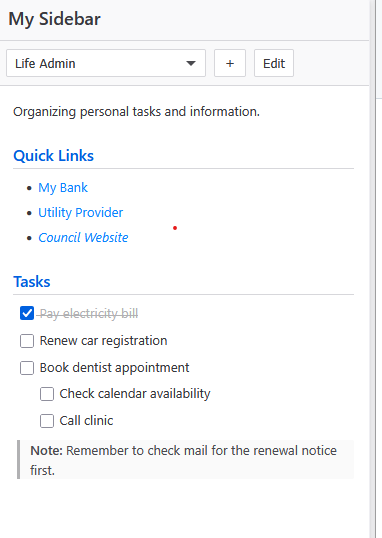
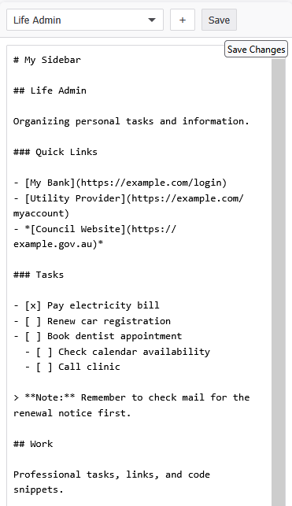

# Markdown Links Sidebar (Firefox Extension)

A Firefox sidebar extension to keep useful links, notes, and task lists handy, organized using simple Markdown syntax.

## Features

* View notes and links directly in the Firefox sidebar.
* Organize content into groups using Markdown H2 headings (`## Group Name`) and switch easily between them using the dropdown selector
* Supports basic Markdown syntax (links, bold, italics, code blocks, blockquotes, task lists)
* Edit your Markdown content directly within the sidebar by clicking `Edit`
* Quickly add the current browser tab as a Markdown link to the selected group by clicking `+`
* Checkbox state (`[ ]`/`[x]`) in task lists is saved when toggled
* All your Markdown data is stored locally on your device using browser storage

## Screenshots

### Sidebar

### Editor

## Installation

**From Mozilla Add-ons:** [Markdown](https://addons.mozilla.org/en-GB/firefox/addon/markdown-sidebar/) (NOTE: Awaiting approval as at 2025-04-12)

## Usage

1.  Open the Firefox sidebar (View > Sidebar > Markdown Sidebar, or use the shortcut if available)
2.  The sidebar will display your notes, grouped by the H2 headings (`##`) in your Markdown text
3.  Use the dropdown menu at the top to switch between different groups (H2 sections)
4.  Click the "Edit" button to modify the raw Markdown source
5.  Click the "Save" button to save your changes and return to view mode
6.  While viewing a group, click the "+" button to add a Markdown link for the current active browser tab into that group
7.  Click checkboxes in task lists (`- [ ]` or `- [x]`) to toggle their state; the change is saved automatically

## Dependencies

This extension uses the following libraries:

* [marked.js](https://marked.js.org/): For parsing Markdown text into HTML
* [DOMPurify](https://github.com/cure53/DOMPurify): For sanitizing the HTML generated by marked.js before rendering, prevening potential security issues

## Privacy Policy

Stores your Markdown notes locally on your device using browser storage [cite: markdown-links-sidebar/sidebar/sidebar.js]. Accesses the current tab's URL and title only when you choose to add it via the "+" button. No data is transmitted or shared externally. (Please see the full policy on the AMO listing).
